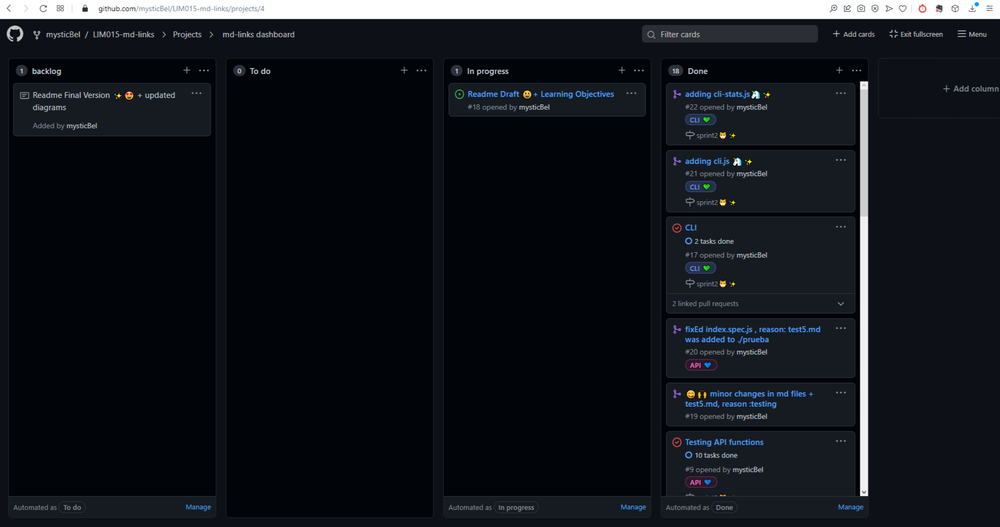
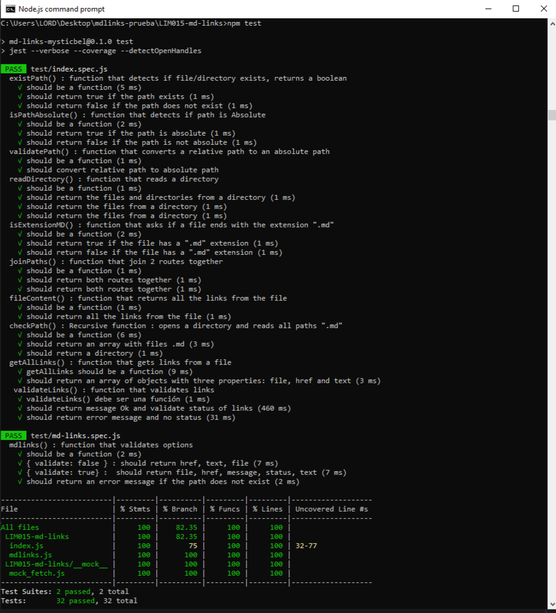

# Markdown Links 🔗 ✨

```js
`
█████████████████████████████████████████████████████████████
███████████             Welcome to             ██████████████
███████████ █▀▄▀█ █▀▀▄ ░░ █░░ ░▀░ █▀▀▄ █░█ █▀▀ ██████████████
███████████ █░▀░█ █░░█ ▀▀ █░░ ▀█▀ █░░█ █▀▄ ▀▀█ ██████████████
███████████ ▀░░░▀ ▀▀▀░ ░░ ▀▀▀ ▀▀▀ ▀░░▀ ▀░▀ ▀▀▀▒██████████████
█████████████████████████████████████████████████████████████
░░░░░░░░░░░░░░░░░░░░░░░░░░░░░░░░░░░░░░░░░░░░░░░░░░░░░░░░░░░░░
░░░░░░░░░░░░░░░░░░▄▄▄▄▄▄▄▄▄▄▄▄▄▄▄░░░░░░░░░░░░░░░░░░░░░░░░░░░░
░░░░░░░░░░░▄▄▄▄█▀▀▀░░░░░░░░░░░░▀▀██░░░░░░░░░░░░░░░░░░░░░░░░░░
░░░░░░░░▄███▄▄▄▄▄▄▄▄▄▄▄▄▄▄▄▄▄▄▄▄▄▄▄█▄▄▄░░░░░░░░   . . .   ░░░
░░░░░░▄▀▀░█░░░░▀█▄▀▄▀██████░▀█▄▀▄▀████▀░░░░░░░░   aw      ░░░
░░░░░░█░░░█░░░░░░▀█▄█▄███▀░░░░▀▀▀▀▀▀▀░▀▀▄░░░░░░ yeaah !!  ░░░
░░░░░░█░░░█░▄▄▄░░░░░░░░░░░░░░░░░░░░░▀▀░░░█░░░░░   . . .   ░░░
░░░░░░█░░░▀█░░█░░░░▄░░░░▄░░░░░▀███▀░░░░░░░█░░░░░░░░░░░░░░░░░░
░░░░░░█░░░░█░░▀▄░░░░░░▄░░░░░░░░░█░░░░░░░░█▀▄░░░░░░░░░░░░░░░░░
░░░░░░░▀▄▄▀░░░░░▀▀▄▄▄░░░░░░░▄▄▄▀░▀▄▄▄▄▄▀▀░░█░░░░░░░░░░░░░░░░░
░░░░░░░█▄░░░░░░░░░░░░▀▀▀▀▀▀▀░░░░░░░░░░░░░░█░░░░░░░░░░░░░░░░░░
░░░░░░░░█░░░░░░░░░░░░░░░░░░░░░░░░░░░░░░▄██░░░░░░░░░░░░░░░░░░░
░░░░░░░░▀█▄░░░░░░░░░░░░░░░░░░░░░░░░░▄▀▀░░░▀█░░░░░░░░░░░░░░░░░`
``` 

## Index

- [1. About md-links](#1-About-md-links)
- [2. How to install mdLinks?](#3-How-to-install-mdLinks-?)
- [3. Flowchart](#2-Flowchart)
- [4. Backlog & Planning](#3-Backlog-&-Planning)
- [5. Learning goals](#4-Learning-goals)


---

## 1. About md-links
 [Markdown](https://en.wikipedia.org/wiki/Markdown) is a very popular lightweight markup language among developers. 
 It is used in many platforms that handle plain text (GitHub, forums, blogs, ...), and it is very common to find several
  files in that format in any type of repository (starting with the traditional README.md).

These Markdown files usually contain links that are often broken or no longer valid and that greatly damages the value of
 the information that you want to share.


In this project, `md-links` is an executable that reads and analyzes files in Markdown format, to verify the links they contain and report some statistics.

 Options:🐾🐿️
- Validate Links(OK, Fail)
- Stats Links(total, unique, broken)


## 2. How to install mdLinks?


## ⬇️Install :
 Install this library with this command :   `  npm install -g ?  `


## 🔍Usage:

```js

// Usage: 
  md-links <path-to-file> [options]

// Commands:
  --v, --validate       Show validate links, makes an HTTP request to find out if the link works or not
  --s, --stats          Show basic statistics about links
  --v --s               Show statistics about links : total, unique, broken
  --validate --stats    Show statistics about links : total, unique, broken
  
// Global options:
  -h, --help            display help for command

``` 


## 3. Flowchart

...


## 4. Backlog & Planning

 I love using Github Projects !! 😍
 


## 5. Learning Objectives


...
---
## Checklist

### General

- [ ] Puede instalarse via `npm install --global <github-user>/md-links`

### `README.md`

- [✔️🐳] Un board con el backlog para la implementación de la librería.
- [ ] Documentación técnica de la librería.
- [ ] Guía de uso e instalación de la librería

### API `mdLinks(path, opts)`

- [✔️🐼 ] El módulo exporta una función con la interfaz (API) esperada.
- [✔️🐼 ] Implementa soporte para archivo individual
- [✔️🐼 ] Implementa soporte para directorios
- [✔️🐼 ] Implementa `options.validate`

### CLI

- [ ] Expone ejecutable `md-links` en el path (configurado en `package.json`)
- [ ] Se ejecuta sin errores / output esperado
- [✔️🦄] Implementa `--validate`
- [✔️🦄] Implementa `--stats`

### Pruebas / tests

- [✔️🐱] Pruebas unitarias cubren un mínimo del 70% de statements, functions,
      lines, y branches.
- [✔️🐱] Pasa tests (y linters) (`npm test`).




---
### NodeSchool workshoppers

- [learnyounode](https://github.com/workshopper/learnyounode)
- [how-to-npm](https://github.com/workshopper/how-to-npm)
- [promise-it-wont-hurt](https://github.com/stevekane/promise-it-wont-hurt)

### Otros recursos

- [Acerca de Node.js - Documentación oficial](https://nodejs.org/es/about/)
- [Node.js file system - Documentación oficial](https://nodejs.org/api/fs.html)
- [Node.js http.get - Documentación oficial](https://nodejs.org/api/http.html#http_http_get_options_callback)
- [Node.js - Wikipedia](https://es.wikipedia.org/wiki/Node.js)
- [What exactly is Node.js? - freeCodeCamp](https://medium.freecodecamp.org/what-exactly-is-node-js-ae36e97449f5)
- [¿Qué es Node.js y para qué sirve? - drauta.com](https://www.drauta.com/que-es-nodejs-y-para-que-sirve)
- [¿Qué es Nodejs? Javascript en el Servidor - Fazt en YouTube](https://www.youtube.com/watch?v=WgSc1nv_4Gw)
- [¿Simplemente qué es Node.js? - IBM Developer Works, 2011](https://www.ibm.com/developerworks/ssa/opensource/library/os-nodejs/index.html)
- [Node.js y npm](https://www.genbeta.com/desarrollo/node-js-y-npm)
- [Módulos, librerías, paquetes, frameworks... ¿cuál es la diferencia?](http://community.laboratoria.la/t/modulos-librerias-paquetes-frameworks-cual-es-la-diferencia/175)
- [Asíncronía en js](https://carlosazaustre.es/manejando-la-asincronia-en-javascript)
- [NPM](https://docs.npmjs.com/getting-started/what-is-npm)
- [Publicar packpage](https://docs.npmjs.com/getting-started/publishing-npm-packages)
- [Crear módulos en Node.js](https://docs.npmjs.com/getting-started/publishing-npm-packages)
- [Leer un archivo](https://nodejs.org/api/fs.html#fs_fs_readfile_path_options_callback)
- [Leer un directorio](https://nodejs.org/api/fs.html#fs_fs_readdir_path_options_callback)
- [Path](https://nodejs.org/api/path.html)
- [Linea de comando CLI](https://medium.com/netscape/a-guide-to-create-a-nodejs-command-line-package-c2166ad0452e)


 


<br>
'md-links' is a project done for [Laboratoria](https://github.com/Laboratoria) ,October 2021 🤗
<br><a href="https://www.linkedin.com/in/maribel-maza/"></a> <a href="https://github.com/mysticBel"></a> &nbsp;