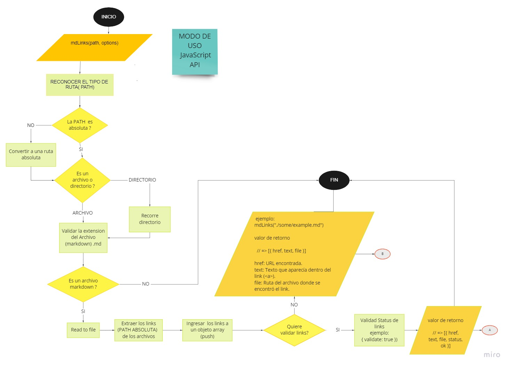
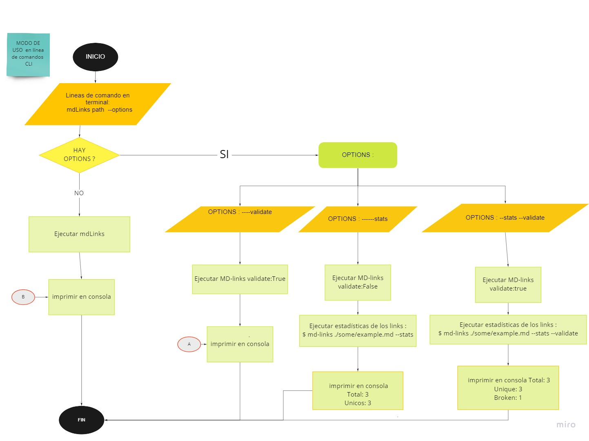

# Markdown Links

[Markdown](https://es.wikipedia.org/wiki/Markdown) es un lenguaje de marcado
ligero muy popular entre developers. Es usado en muchísimas plataformas que
manejan texto plano (GitHub, foros, blogs, ...), y es muy común
encontrar varios archivos en ese formato en cualquier tipo de repositorio
(empezando por el tradicional `README.md`).

Estos archivos `Markdown` normalmente contienen _links_ (vínculos/ligas) que
muchas veces están rotos o ya no son válidos y eso perjudica mucho el valor de
la información que se quiere compartir.

Dentro de una comunidad de código abierto, nos han propuesto crear una
herramienta usando [Node.js](https://nodejs.org/), que lea y analice archivos
en formato `Markdown`, para verificar los links que contengan y reportar
algunas estadísticas.


## Diagrama de flujo inicial 

modo de uso :Api



modo de uso: en comandos CLI



## Documentación técnica de la librería

La funcionalidad principal de la librería es poder extraer los links de un archivo markdown. 

Esto se puede lograr si el usuario proporciona una ruta a el o los archivos markdown que desee analizar. Estos links también pueden ser analizados mediante 2 opciones, validate y stats.

#### `mdLinks(path, options)`

##### Argumentos

- `path`: Ruta absoluta o relativa al archivo o directorio. Si la ruta pasada es
  relativa, debe resolverse como relativa al directorio desde donde se invoca
  node - _current working directory_).
- `options`: Un objeto con las siguientes propiedades:
  * `validate`: Booleano que determina si se desea validar los links
    encontrados.

##### Valor de retorno

La función retorna los links, los cuales contienen las siguientes propiedades:

- `href`: URL encontrada.
- `text`: Texto que aparecía dentro del link (`<a>`).
- `file`: Ruta del archivo donde se encontró el link.

#### Ejemplo

```js
const mdLinks = require("md-links");

mdLinks("./test/dir")
  .then(links => {
    // => [{ href, text, file }]
  })
  .catch(console.error);
```

```js
const mdLinks = require("md-links");

mdLinks("./test/dir", { validate: true })
  .then(links => {
    // => [{ href, text, file, status, ok }]
  })
  .catch(console.error);
```


```js
mdLinks("./some/dir/readme.md")
  .then(links => {
    // => [{ href, text, file }]
  })
  .catch(console.error);
```

### CLI (Command Line Interface - Interfaz de Línea de Comando)

El ejecutable de nuestra aplicación también puede ejecutarse de la siguiente
manera a través de la terminal:

`md-links <path-to-file> [options]`

Por ejemplo:

```sh
$ mdlinks ./some/example.md
./some/example.md http://algo.com/2/3/ Link a algo
./some/example.md https://otra-cosa.net/algun-doc.html algún doc
./some/example.md http://google.com/ Google
```

El comportamiento por defecto no valida si las URLs responden ok o no,
solo identifica el archivo markdown (a partir de la ruta que recibe como
argumento), analiza el archivo Markdown e imprime los links que vaya
encontrando, junto con la ruta del archivo donde aparece y el texto
que hay dentro del link (truncado a 50 caracteres).

#### Options

##### `--validate`

Si pasamos la opción `--validate`, el módulo hace una petición HTTP para
averiguar si el link funciona o no. Si el link resulta en una redirección a una
URL que responde ok, entonces consideraremos el link como ok.

Por ejemplo:

```sh
$ mdlinks ./some/example.md --validate
./some/example.md http://algo.com/2/3/ ok 200 Link a algo
./some/example.md https://otra-cosa.net/algun-doc.html fail 404 algún doc
./some/example.md http://google.com/ ok 301 Google
```

Vemos que el _output_ en este caso incluye la palabra `ok` o `fail` después de
la URL, así como el status de la respuesta recibida a la petición HTTP a dicha
URL.

##### `--stats`

Si pasamos la opción `--stats` el output (salida) se le muestra estadísticas
básicas sobre los links.

```sh
$ mdlinks ./some/example.md --stats
Total: 3
Unique: 3
```

También podemos combinar `--stats` y `--validate` para obtener estadísticas que
necesiten de los resultados de la validación.

```sh
$ mdlinks ./some/example.md --stats --validate
Total: 3
Unique: 3
Broken: 1
```

## Guía de uso e instalación de la librería

Módulo instalable via `npm install AlexisPescoran/md-links`. Este módulo incluye un ejecutable como una interfaz que se puede importar con `require`.

```sh
1.- En el terminal de tu proyecto: npm install AlexisPescoran/md-links
2.- Puedes hacer importarlo mediante require (ver los ejemplos de arriba para más detalle)
```


